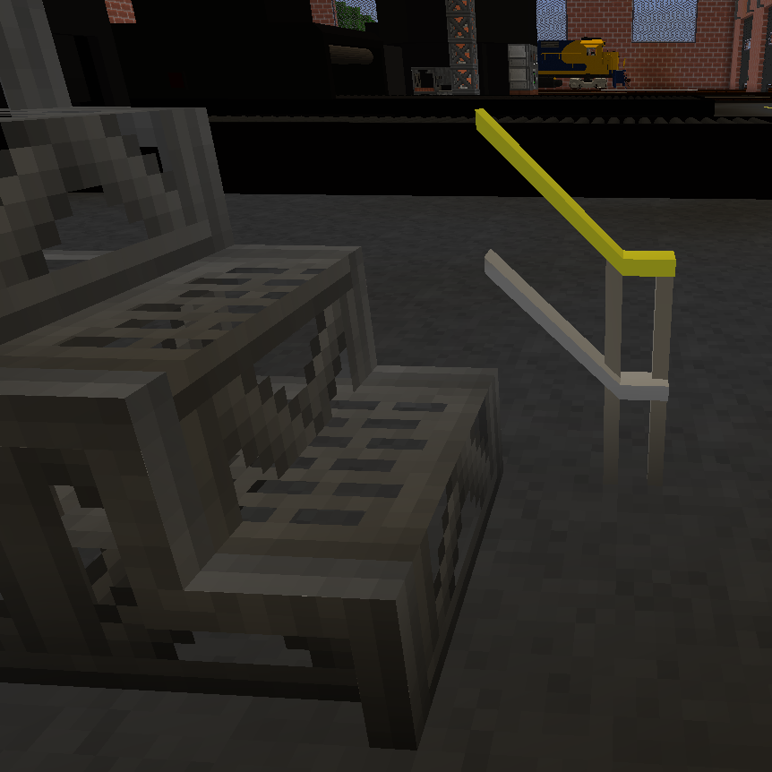

# Industrial Railing

A basic railing for your industrial needs. Comes in dirty gray with yellow hand rails for safety.

Intended primarily for raised floors and stairs, the railing is designed to be placed on a tile that parallels the surface of the walkway. This allows it to descend with stairs without colliding with the bounding boxes of the stairs themselves. Demo is shown along side Immersive Engineering Steel Scaffolding, with IE Steel Block for supports. No mods outside of LT are required for the railings themselves, however. All sections are one block in length, with vertical supports arranged for repeatability. The railing is not symmetrical on the narrow axis, take care when positioning that the desired side faces the walkway.

- [Download the zip](IndustrialRailing.zip?raw=true)

## [IndustrialRailingCorner.txt](IndustrialRailingCorner.txt)

A corner section with vertical supports on both ends. Useful to stand alone or as the center of a longer section.

## [IndustrialRailingLanding.txt](IndustrialRailingLanding.txt)

The section of railing for the bottom landing of a set of stairs. Transitions from a level surface with no railing to ascending stairs.

## [IndustrialRailingStep.txt](IndustrialRailingStep.txt)

Ascending/descending stairs

## [IndustrialRailingStraight.txt](IndustrialRailingStraight.txt)

A horizontal straight section for level/flat floors.

## [IndustrialRailingTopStep.txt](IndustrialRailingTopStep.txt)

A transition from ascending/descending to horizontal. Perfect for the last step at the top of your stairs.

## [IndustrialRailingTopStepInsideCorner.txt](IndustrialRailingTopStepInsideCorner.txt)

A transition from ascending/descending to horizontal, where the landing at the top of the stairs takes an immediate 180-degree turn. Requires a one-block gap between the parallel walkway and the stairs.

## [IndustrialRailingTopStepNarrow.txt](IndustrialRailingTopStepNarrow.txt)

A transition from ascending/descending to horizontal, where the railing makes an immediate 180-degree turn and remains much closer to the stairs than the previous. Good for the railing around the top of stairwells.

