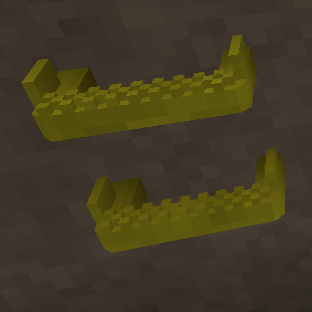
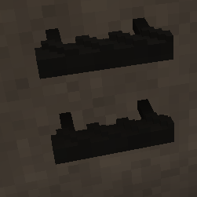
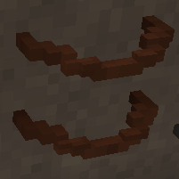
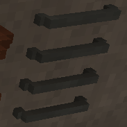
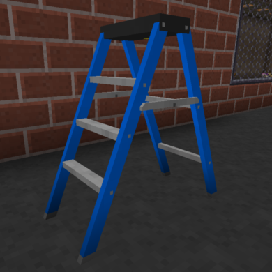

# Ladders

A selection of ladders and step irons, perfect for industrial settings. **All use a 32-voxel grid. No additional mods required.**

- [Download the zip](Ladders.zip?raw=true)

## [HighVisStepIron.txt](HighVisStepIron.txt?raw=true)

A high-visibility, anti-corrosion coated step iron.

## [AntiCorrosionStepIron.txt](AntiCorrosionStepIron.txt?raw=true)

An older anti-corrosion coated step iron. Something I remember from my wayward youth. What? _You_ didn't play in the sewers?

## [RustyCableStepIron.txt](RustyCableStepIron.txt?raw=true)

An old-school step iron made from steel cable. Complete with rust and that delightful sag that happens after a few uses. What? I'm not as light as I used to be...

## [MetalRungLadder.txt](MetalRungLadder.txt?raw=true)

A basic metal rung ladder. Inspired by Engineer's Decor. One of the first things I created with LittleTiles. _Rebuilt to no longer require Immersive Engineering._

## [StepLadder.txt](StepLadder.txt?raw=true)

A basic 6-foot fiberglass step ladder. Please don't stand on the top step. No, no, You aren't supposed to climb the back either.

