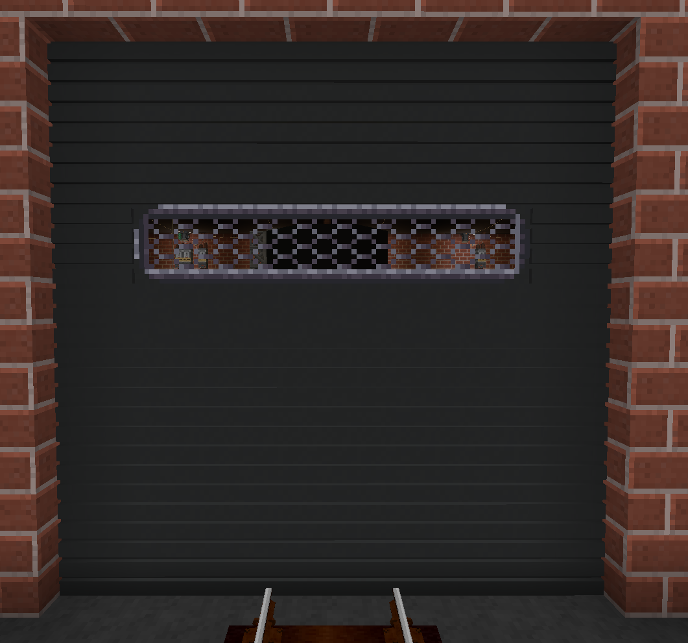
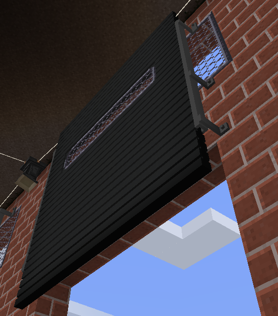
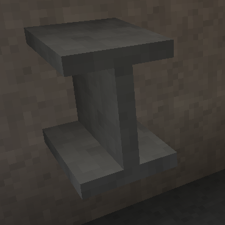
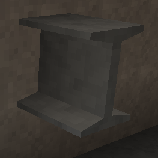
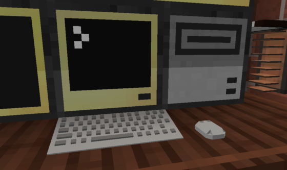
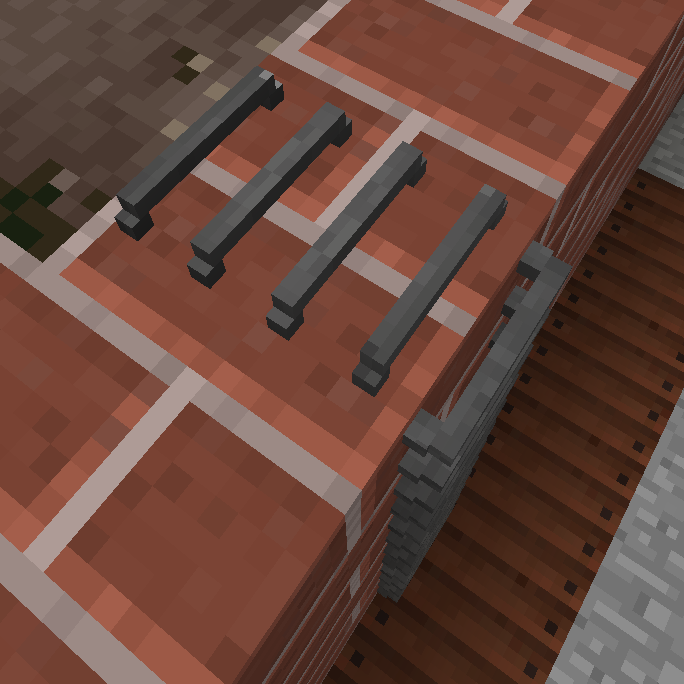
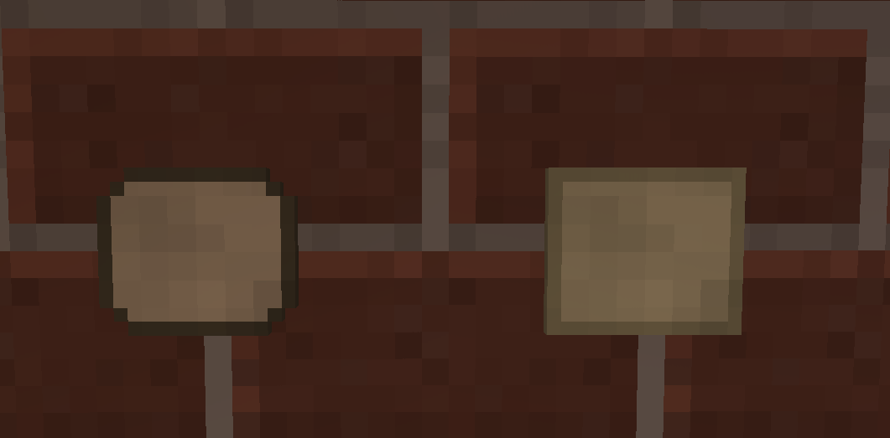
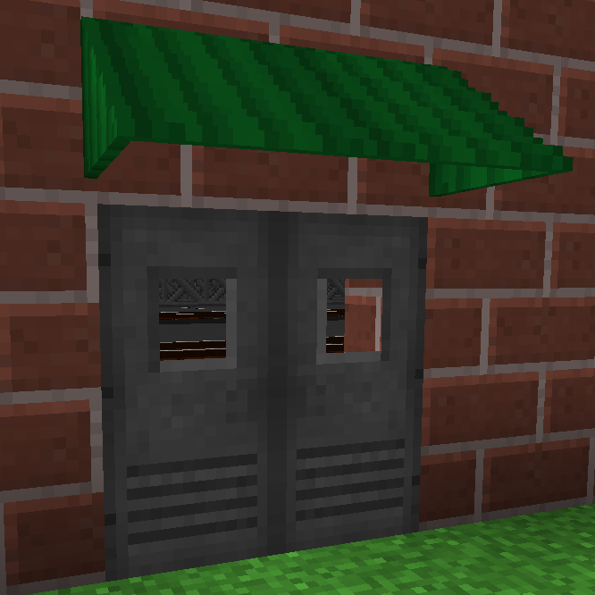
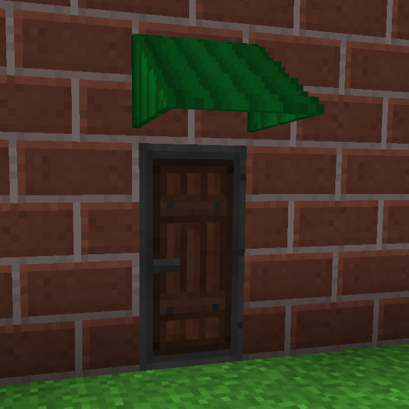
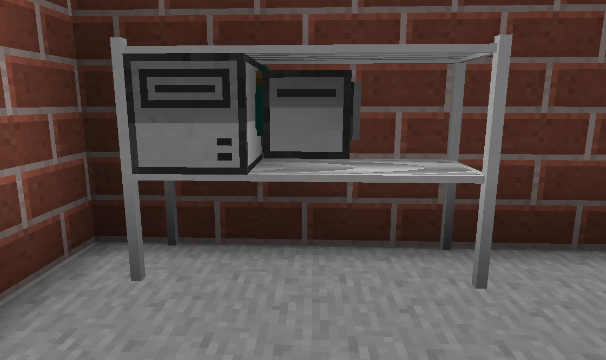

# LittleTiles exports

These are various LittleTiles exports that I've made.

- [Industrial Railing](./Industrial%20Railing/) - A collection of generic industrial railing sections

- [Sawtooth Roof](./Sawtooth%20Roof/) - A collection of structures for building a sawtooth roof.

- [GarageDoor.txt](GarageDoor.txt?raw=true) - A simple Garage Door that opens upwards six blocks after sliding inwards one block. Axis is the lower left. Requires Chisel.

- [GarageDoorTrack.txt](GarageDoorTrack.txt?raw=true) - Some track for the Garage Door so it doesn't just float in mid air when it's open.

- [H-Beam.txt](H-Beam.txt?raw=true) - Steel colored H beam (also called Wide Flange or W beam). Simple design, trim any surface to fit installation. Single block sized.

- [I-Beam.txt](I-Beam.txt?raw=true) - Steel colored I beam (also called American Standard, or S beam). Single block sized.

- [Keyboard.txt](Keyboard.txt?raw=true) - Little keyboard accessory for ComputerCraft. 32-voxel grid.
- [Mouse.txt](Mouse.txt?raw=true) - Little mouse accessory for ComputerCraft. 32-voxel grid.

- [MetalRungLadder.txt](MetalRungLadder.txt?raw=true) - The horizontal equivalent to the `Metal Rung Ladder` from Engineer's Decor. Purely decorative. 32-voxel grid. Requires Immersive Engineering (Steel Block).

 - [TinyAdvancedRecipe.txt](TinyAdvancedRecipe.txt?raw=true) - A tiny, decorative, Advanced Recipe. 32-voxel grid.
 - [TinyRecipe.txt](TinyRecipe.txt?raw=true) - A tiny, decorative, Little Recipe. 32-voxel grid.

 - [SheetmetalAwningSingle.txt](SheetmetalAwningSingle.txt?raw=true) - A sheetmetal awning in classic awning green. Sized for single door, slightly wider than door. Requires Immersive Engineering.
 - [SheetmetalAwningDouble.txt](SheetmetalAwningDouble.txt?raw=true) - A sheetmetal awning in classic awning green. Sized for double doors, slightly wider than doors. Requires Immersive Engineering.

- [Shelf.txt](Shelf.txt?raw=true) - A basic wire shelf, capable of holding three blocks on the middle shelf. Contrary to manufacturer's instructions and warnings, you can climb it. Comes in black, unlike the outdated Manufacturer's photo. Items shown on shelf are for reference only and not included with your purchase. Uses grid 32.

