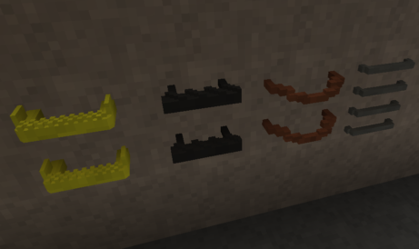
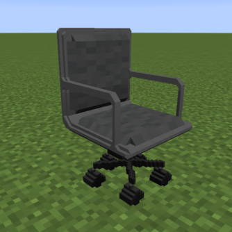
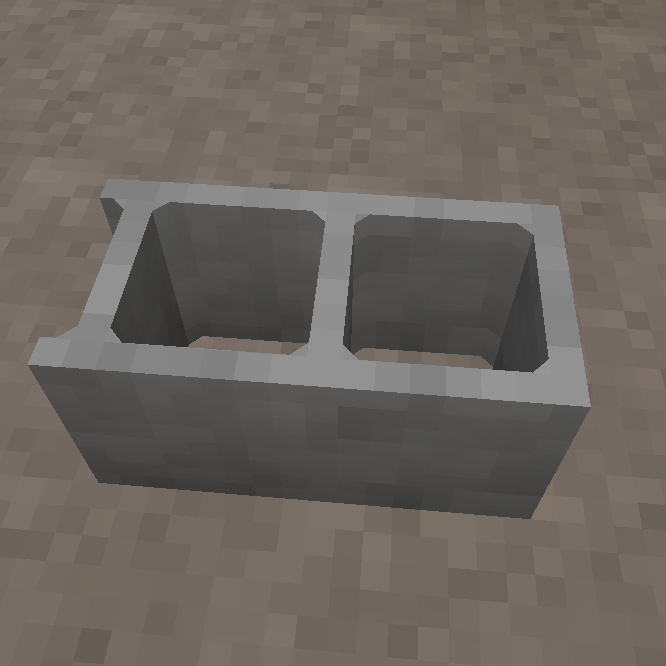
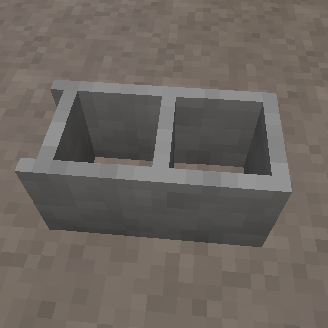
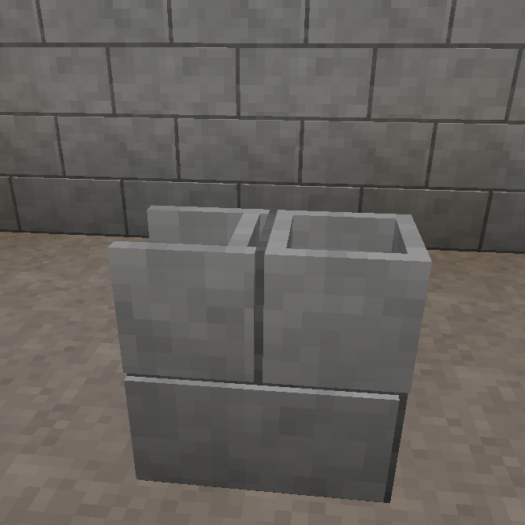
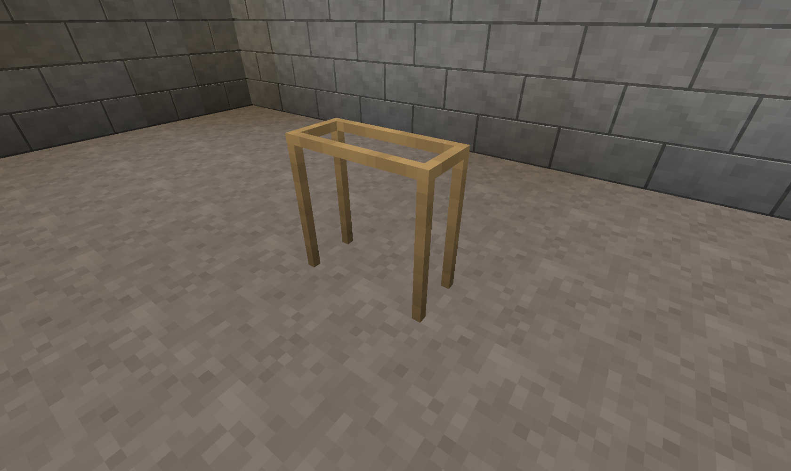
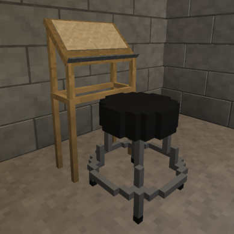
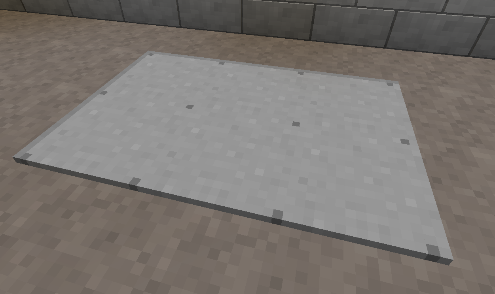
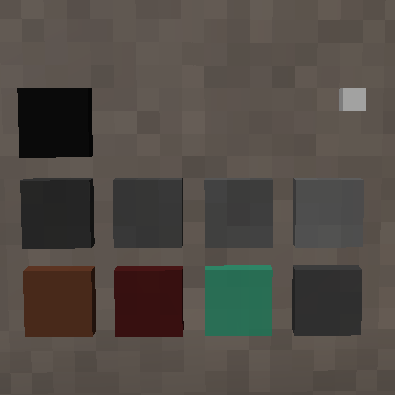
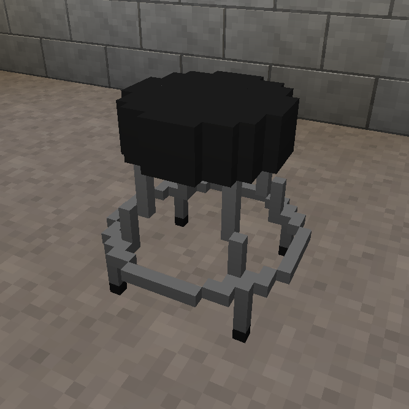

# LittleTiles exports

These are various LittleTiles exports that I've made.

- [Industrial Railing](./Industrial%20Railing/) - A collection of generic industrial railing sections

- [Ladders](./Ladders/) - A collection of ladders and step irons

- [Sawtooth Roof](./Sawtooth%20Roof/) - A collection of structures for building a sawtooth roof.

- [CheapOfficeChair.txt](CheapOfficeChair.txt?raw=true) - A cheap office chair. Looks kinda uncomfortable. I'm glad I don't have to sit in it. 32-voxel grid.

- [Cinderblock.txt](Cinderblock.txt?raw=true) - A cinderblock, for all your holding it down, holding it up, and throwing needs. Wait. No. Don't throw it. Not at me!

- [Cinderblock-basic.txt](Cinderblock-basic.txt?raw=true) - A low-tile version of the cinderblock. Because yeah, you're that cheap.

- [Cinderblock-wall.txt](Cinderblock-wall.txt?raw=true) - A single block of cinderblock wall, with mortar. Remember that time Kiro went idle and we walled him in? Heh. 32-voxel grid.

- [DraftingTableStand.txt](DraftingTableStand.txt?raw=true) - A stand for the Immersive Vehicles (MTS) Drafting Table. IMO it looks silly sitting way down there on the floor. A good companion for this is the Stool.

- [Drywall.txt](Drywall.txt?raw=true) - It's a sheet of drywall. No tape. No mud. Just some screws to hold it up. Yeah, a few of em are crooked. Just like when I do drywall IRL...

- [GarageDoor.txt](GarageDoor.txt?raw=true) - A simple Garage Door that opens upwards six blocks after sliding inwards one block. Axis is the lower left. Requires Chisel.

- [GarageDoorTrack.txt](GarageDoorTrack.txt?raw=true) - Some track for the Garage Door so it doesn't just float in mid air when it's open.

- [H-Beam.txt](H-Beam.txt?raw=true) - Steel colored H beam (also called Wide Flange or W beam). Simple design, trim any surface to fit installation. Single block sized.

- [I-Beam.txt](I-Beam.txt?raw=true) - Steel colored I beam (also called American Standard, or S beam). Single block sized.

- [ImmersivePalette.txt](ImmersivePalette.txt?raw=true) - A collection of tiles in colors and materials I use for building structures to compliment Immersive Engineering and related mods. Uses only LittleTiles blocks. Each 3x3 (@16) tile is a named structure to give a clue as to what that material was originally designed for. Ignore that extra white tile. I needed something to put it in a new recipe.

- [Keyboard.txt](Keyboard.txt?raw=true) - Little keyboard accessory for ComputerCraft. 32-voxel grid.
- [Mouse.txt](Mouse.txt?raw=true) - Little mouse accessory for ComputerCraft. 32-voxel grid.

 - [TinyAdvancedRecipe.txt](TinyAdvancedRecipe.txt?raw=true) - A tiny, decorative, Advanced Recipe. 32-voxel grid.
 - [TinyRecipe.txt](TinyRecipe.txt?raw=true) - A tiny, decorative, Little Recipe. 32-voxel grid.

 - [SheetmetalAwningSingle.txt](SheetmetalAwningSingle.txt?raw=true) - A sheetmetal awning in classic awning green. Sized for single door, slightly wider than door. Requires Immersive Engineering.
 - [SheetmetalAwningDouble.txt](SheetmetalAwningDouble.txt?raw=true) - A sheetmetal awning in classic awning green. Sized for double doors, slightly wider than doors. Requires Immersive Engineering.

- [Shelf.txt](Shelf.txt?raw=true) - A basic wire shelf, capable of holding three blocks on the middle shelf. Contrary to manufacturer's instructions and warnings, you can climb it. Comes in black, unlike the outdated Manufacturer's photo. Items shown on shelf are for reference only and not included with your purchase. Uses grid 32.

- [Stool.txt](Stool.txt?raw=true) - A simple single-block stool. Rubber-tipped feet to protect your floor. An excellent companion to the Drafting Table Stand for Immersive Vehicles.

