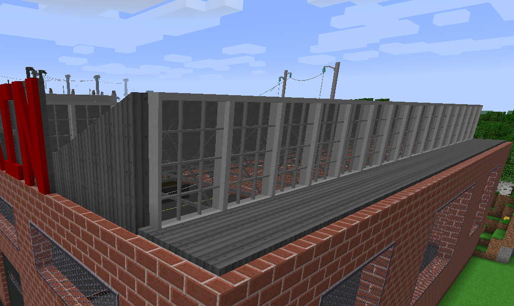
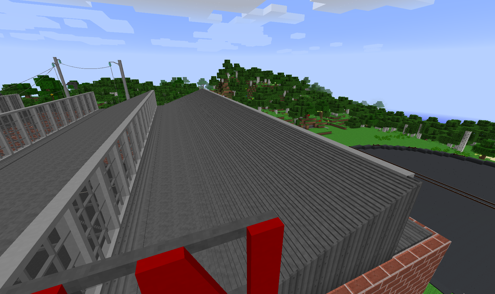
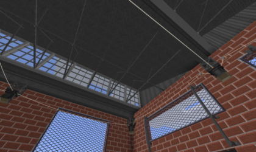
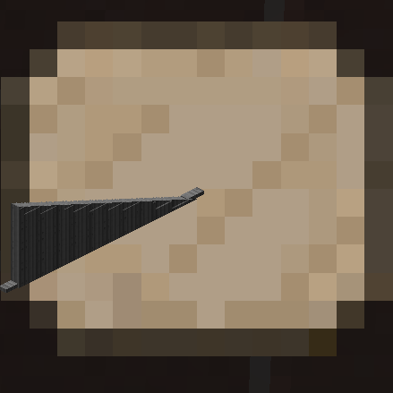
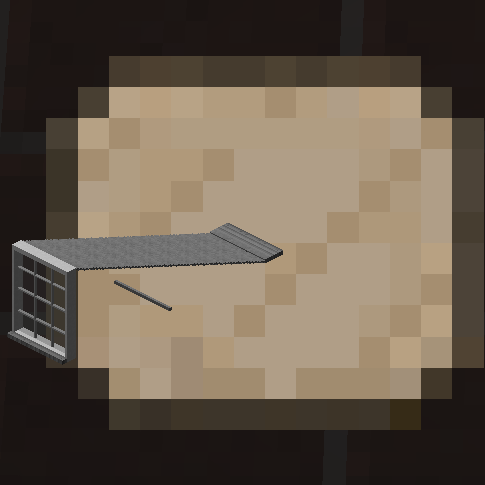
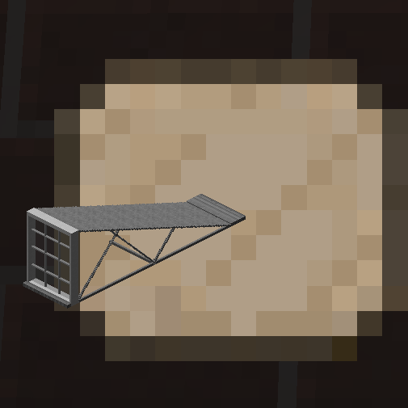

# Sawtooth Roof

A staple of old-school industry. Plus, they just look cool.

These roof sections are sized to fit with my garage doors, assuming the tooth profile is visible from the same wall as the doors and a 5-block gap between each door. All require Iron Sheetmetal from Immersive Engineering, however only the end section uses it in any quantity. The center sections could have it easily replaced with something else.

- [Download the zip](SawtoothRoof.zip?raw=true)

## [SawtoothRoofEnd.txt](SawtoothRoofEnd.txt?raw=true)
A reversible end section. Made primarily of sheetmetal. Requires Immersive Engineering.

## [SawtoothRoofNoSupport.txt](SawtoothRoofNoSupport.txt?raw=true)
A center section with no vertical cross bracing. You'll want one of these on one end next to the end piece. Uses small amounts of sheetmetal, easily replaced if desired, otherwise requires Immersive Engineering.

## [SawtoothRoofSupport.txt](SawtoothRoofSupport.txt?raw=true)
A center section with vertical cross bracing. The majority of the roof sections are typically made of this one. Cross bracing is only on one side, such that it repeats properly when multiples are placed side by side. Uses small amounts of sheetmetal, easily replaced if desired, otherwise requires Immersive Engineering.

